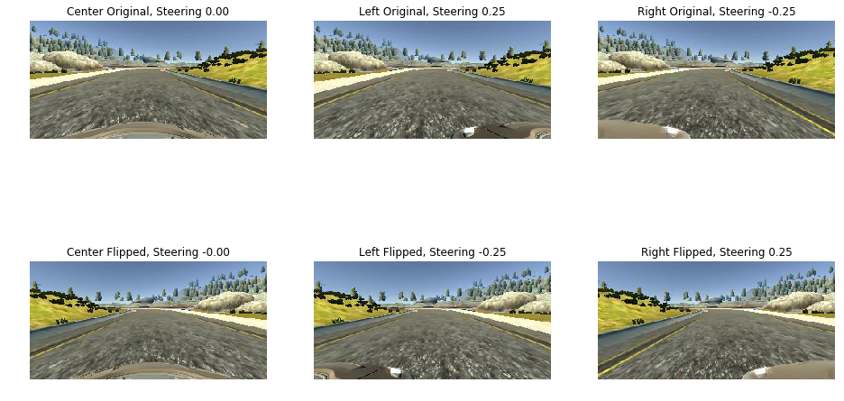
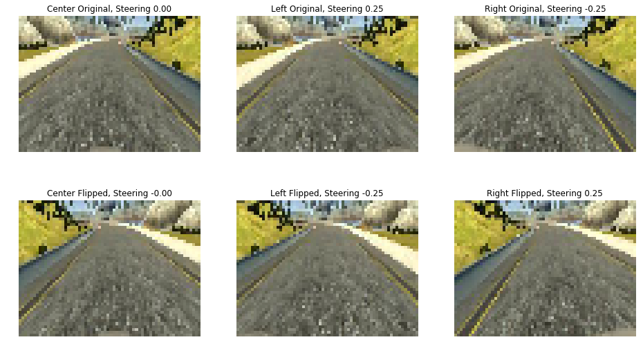
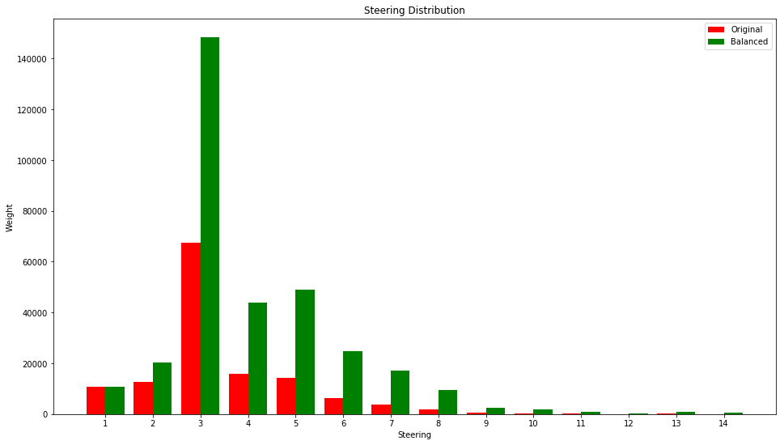

## README

### Technical Report for Behavioral Cloning for Autonomous Driving

---


The goals of this project are the following:
* Use the simulator to collect data of good driving behavior
* Build, a convolution neural network in Keras that predicts steering angles from images
* Train and validate the model with a training and validation set
* Test that the model successfully drives around track one without leaving the road

---

### Files Submitted & Code Quality

---

#### 1. Submission includes all required files and can be used to run the simulator in autonomous mode

My project includes the following files:
* **Behavioral-Cloning.ipynb & model.py**: the script to create and train the model
* **drive.py**: driving the car in autonomous mode
* **model.h5**: the final convolution neural network for autonomous driving
* **README.md**: technical report

#### 2. Submission includes functional code
Using the simulator and my **drive.py** file, the car can be driven autonomously around the track by executing

```sh
python drive.py model-[RESOLUTION-WIDTH]-[RESOLUTION-HEIGHT]-[QUALITY].h5
```

#### 3. Submission code is usable and readable

The **model.py** file contains the code for training and saving the convolution neural network.

The file shows the pipeline I used for training and validating the model, and it contains comments to explain how the code works.

---

### Model Architecture and Training Strategy

---

#### 1. An appropriate model architecture has been employed

My model is a slight modification of NVIDIA net. The layers and corresponding parameters are shown in the following table:

| Layer        |     Description	        				                                                             |
|:------------:|:---------------------------------------------------------------------------------------------:|
| standardize  | per image standardization                                                                     |
| conv1				 | kernel: 3x3x32, stride: 1x1, padding: 'SAME', activation: 'ReLU', initialization: 'He normal' |
| conv2				 | kernel: 3x3x48, stride: 1x1, padding: 'SAME', activation: 'ReLU', initialization: 'He normal' |
| pool1	       | max pooling, kernel: 2x2, stride: 2x2                                                         |
| conv3				 | kernel: 3x3x64, stride: 1x1, padding: 'SAME', activation: 'ReLU', initialization: 'He normal' |
| pool2	       | max pooling, kernel: 2x2, stride: 2x2                                                         |
| dropout1     | keep prob: 0.25                                                                               |
| flattened    | fully connected layer input                                                                   |
| fc1          | Nonex128, activation: 'ReLU', initialization: 'He normal'                                     |
| fc2          | 128x64, activation: 'ReLU', initialization: 'He normal'                                       |
| dropout2     | keep prob: 0.50                                                                               |
| output       | 64x1, activation: 'linear', initialization: 'glorot uniform'                                  |

The Keras code for model definition is as follows:

```python
model = Sequential()

# Preprocessing:
model.add(
    Lambda(
        standardize,
        input_shape = INPUT_SHAPE
    )
)
# Convs:
model.add(
    Convolution2D(
        32, 3, 3, border_mode='same',
        activation='relu',
        init='he_normal'
    )
)
model.add(
    Convolution2D(
        48, 3, 3, border_mode='same',
        activation='relu',
        init='he_normal'
    )
)
model.add(
    MaxPooling2D(pool_size=(2, 2))
)
model.add(
    Convolution2D(
        64, 3, 3, border_mode='same',
        activation='relu',
        init='he_normal'
    )
)
model.add(
    MaxPooling2D(pool_size=(2, 2))
)
model.add(
    Dropout(0.25)
)
# Flatten:
model.add(
    Flatten()
)
# Fully connected:
model.add(
    Dense(
        128,
        activation='relu',
        init='he_normal'
    )
)
model.add(
    Dense(
        64,
        activation='relu',
        init='he_normal'
    )
)
model.add(
    Dropout(0.50)
)
# Output:
model.add(
    Dense(
        N_OUTPUT,
        activation='linear'
    )
)

model.compile(
    loss='mean_squared_error',
    optimizer=Adam(lr=1e-3),
    metrics=['mae']
)
```

#### 2. Attempts to reduce overfitting in the model

Following methods are used to reduce overfitting:

1. Training data is augmented to generate more available data
2. Train/Dev/Test split is used for model building & evaluation
3. Training examples are weighted so as to strike a good balance between straight & curved lane performance
4. During the training process, dropout & early stopping are used to further prevent overfitting.

#### 3. Model parameter tuning

The should be tuned hyper-parameters for my network are as follows:

| Parameter           |     Description	        				                                                             |
|:-------------------:|:--------------------------------------------------------------------------------------------:|
| steering correction | target steering correction for left & right camera images                                    |
| weight unit         | steering unit for effective sample count calculation                                         |
| ratio               | sample weight combination ratio                                                              |
| learning rate       | learning rate for Adams optimizer                                                            |

All the above hyper-parameters are tuned through a trial-and-error approach:

* First train the network with chosen hyper parameters
* Observe the network's performance on testing track and identify the scene in which it performs badly

The final hyper parameters are as follows:

| Parameter           |     Description	        				                                                             |
|:-------------------:|:--------------------------------------------------------------------------------------------:|
| steering correction | 0.25                                                                                         |
| weight unit         | 0.10                                                                                         |
| ratio               | 0.60                                                                                         |
| learning rate       | 1e-3                                                                                         |

#### 4. Appropriate training data

I just used the given sample training data after I find add my own driving data could easily ruined the model performance since I'm a horrible simulator driver :)

---

### Model Architecture and Training Strategy

---

#### 1. Discusses the approach taken for deriving and designing a model architecture fit for solving the given problem.

My whole iteration process is built upon NVIDIA net [NVIDIA net](end-to-end-deep-network-for-autonomous-car.pdf)

* In the first iteration:

1. the layers are stacked exactly as it in final model except dropout2 is not used
2. kernel size for conv layers are changed from 5-by-5 to 3-by-3 since smaller image is used than NVIDIA net
3. the number of hidden units for the two fully-connected layers are 256 & 128, respectively

The weighting ratio between straight & curved lane is set to default value, 0.5.

* But after the first training iteration, I observed:
1. the U-turn of validation error, which is the typical indication of overfitting, and the discrepancy between training & validation performance.
2. the models poor performance on curved lanes, especially the two sharp turns after going over the stone bridge

* So in the second iteration:

1. dropout2 is added for fully-connected layer output
2. the number of hidden units are shrinked to 128 & 64, respectively

The weighting ratio between the two types of lane is increased to final value 0.6

This network could not attain the fancy mae as the first network did, but it performs well on the testing track.

So I chose the architecture attained in iteration 2 as my final network architecture.

#### 2. Final Model Architecture

Please refer to **Model Architecture and Training Strategy** section for my final model architecture.

#### 3. Discuss how the dataset was generated and show examples of images from the dataset

I think the real challenge of this project is **data collection & data preprocessing**.

* For **data collection**, after I realized I am a terrible in-simulator driver, I gave up generating data on my own since **the non-smoothing control inputs contained in my driving actions could only induce optimization difficulties to training process**

* For **data augmentation**, below methods are used to generate more training data:

1. All three camera inputs are used and a steering correction for left & right camera images is used to estimate the proper control inputs
2. All the images are flipped left to right and corresponding steerings are negated to double the training set size
3. Random image are not generated since I think the steering input is strongly correlated with geometric structure in image.
Keras's random image generator could easily distort the geometric structure in image and cause troubles for optimization process.

4. The top 50 and bottom 20 pixels are cropped to reduce each image to 90-by-320(done in transformer Preprocessor)
5. Image is resized to 48-by-64(done in transformer Preprocessor)
6. Image is standardized before it is fed into the network(done in standardize layer of network)


Below is the code snippet for [Preprocessor](behavioral_cloning/preprocessors/preprocess.py)

```python
class Preprocessor(TransformerMixin):
    def __init__(
        self,
        input_size = (320, 160),
        cropping = ((50, 20), (0, 0)),
        output_size = (64, 45)
    ):
        W, H = input_size
        (
            (TOP_OFFSET, BOTTOM_OFFSET),
            (LEFT_OFFSET, RIGHT_OFFSET)
        ) = cropping

        self.top = TOP_OFFSET
        self.bottom = H - BOTTOM_OFFSET
        self.left = LEFT_OFFSET
        self.right = W - RIGHT_OFFSET

        self.output_size = output_size

    def transform(self, X):
        """ Preprocess raw frames
        """
        return np.asarray(
            [self._resize(x) for x in X]
        )

    def fit(self, X, y=None):
        return self

    def set_params(self, **kwargs):
        self.__dict__.update(kwargs)

    def _resize(self, X):
        """
        """
        # Crop:
        cropped = X[self.top:self.bottom, self.left:self.right]

        # Resize:
        resized = cv2.resize(cropped, self.output_size)

        return resized
```

Below is the code snippet for mapping function implementation used standardize layer

Here tensorflow must be imported to make its function work in Keras Lambda layer

```
def standardize(X):
    """ Wrapper of Tensorflow for image standardization
    ""    # Set up session:
    from keras.backend import tf as ktf

    return ktf.map_fn(
        lambda x: ktf.image.per_image_standardization(x),
        X
    )
```

The dataset is further processed through sample weighting.

The code snippet for sample weighting is as follows.

```python
def calculate_sample_weights(steering, weight_unit = 0.1, ratio = 0.5):
    """ Calculate sample weights based on steering angle
    """
    # Make 0 steering sample have effective count '1':
    num_effective = (np.absolute(y_train) + weight_unit) / weight_unit

    # Try to strike a balance between straight & curve lane performance:
    weights = (1.0 - ratio) * num_effective + ratio * (num_effective**2)

    return weights

model.fit(
    X_train, y_train,
    sample_weight = calculate_sample_weights(y_train, ratio = 0.6),
    batch_size = BATCH_SIZE,
    nb_epoch = N_EPOCHES,
    verbose = 1,
    shuffle=True, validation_split=0.10, callbacks=callbacks
)
```

If even weight is used, training with mini-batch cannot effectively learn the control behavior around sharp turns
So samples are re-weighted by its correct steering angle.

Here is the visualization of raw & re-weighted steering distribution:



#### 4. Autonomous driving video demo

The demo could be reached through this link [Autonomous Driving Video Demo](output_videos/demo.mp4)
